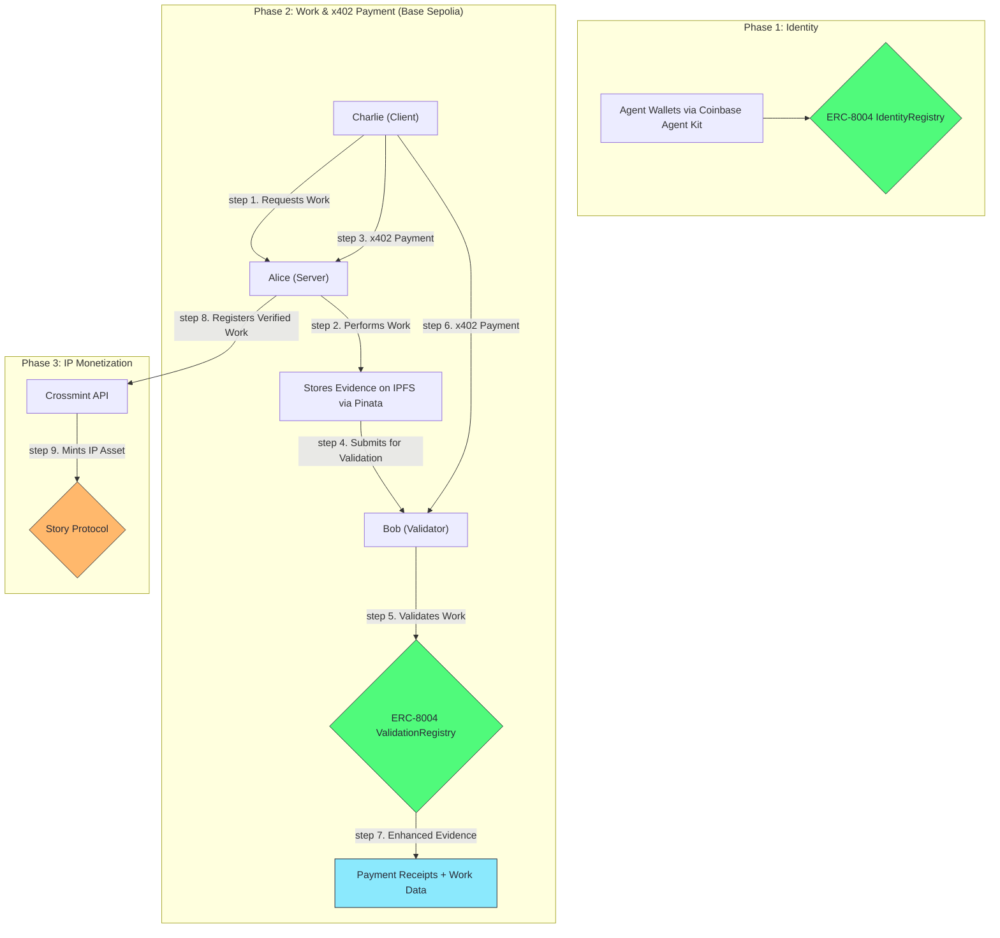

# ChaosChain Genesis Studio

**The first end-to-end commercial prototype for the on-chain agent economy with x402 payments.**

This repository demonstrates the complete lifecycle of autonomous commerce, powered by the ChaosChain protocol vision and enhanced with Coinbase's x402 payment protocol. See AI agents establish on-chain identity via ERC-8004, perform verifiable work, receive frictionless x402 payments, and lay the foundation for long-term IP monetization.


## The Vision: From Verifiable Work to Monetizable IP

This is more than just an example of ERC-8004. It's a working blueprint for a new economy where AI agents can:
1.  **Work:** Perform complex tasks and generate valuable data.
2.  **Verify:** Have their work audited and proven on-chain.
3.  **Settle:** Receive frictionless x402 payments with cryptographic receipts.
4.  **Own:** Convert their verified work into new, royalty-bearing IP assets.

This demo showcases the core loop that will power the ChaosChain protocol and its future ecosystem of specialized "Studios," enhanced with x402 for seamless agent-to-agent commerce.

## Architecture: The Full Commercial Loop

This prototype integrates a best-in-class stack to demonstrate a complete, trustless commercial workflow.



### Core Technologies
-   **Agent Wallets:** [Coinbase Agent Kit](https://docs.cdp.coinbase.com/agent-kit/overview) for secure, server-side EOA management.
-   **On-Chain Standard:** Our official [ERC-8004 Reference Implementation](https://github.com/ChaosChain/trustless-agents-erc-ri) for identity and validation.
-   **x402 Payments:** [Coinbase's x402 Protocol](https://www.x402.org/) for frictionless agent-to-agent payments with cryptographic receipts.
-   **AI Engine:** [CrewAI](https://www.crewai.com/) for sophisticated, multi-agent workflows.
-   **Decentralized Storage:** [IPFS](https://ipfs.tech/) via [Pinata](https://www.pinata.cloud/) for permanent, verifiable evidence storage.
-   **Settlement:** Official **USDC** on **Base Sepolia** for realistic, on-chain settlement.
-   **IP Layer:** [Story Protocol](https://www.story.foundation/) via [Crossmint API](https://docs.crossmint.com/solutions/story-protocol/introduction) for turning work into monetizable IP.

---

## Quick Start

### Prerequisites
1.  **Python 3.8+** with `pip`.
2.  **API Keys & Endpoints:**
    -   A **Base Sepolia RPC URL**.
    -   An **Operator Private Key** (a fresh wallet with Base Sepolia ETH for gas).
    -   A **Pinata JWT** for IPFS uploads.
    -   A **Crossmint API Key** for the Story Protocol integration.
    -   **x402 Dependencies** (automatically installed via requirements.txt).

### Installation

1.  **Clone the repository:**
    ```bash
    git clone https://github.com/ChaosChain/chaoschain-genesis-studio.git
    cd chaoschain-genesis-studio
    ```

2.  **Install Python dependencies:**
    ```bash
    pip install -r requirements.txt
    ```

3.  **Configure your environment:**
    ```bash
    cp .env.example .env
    ```
    Now, edit the `.env` file and add your RPC URL, private key, and API keys.

### Run the Demo

Execute the entire end-to-end flow with a single command:
```bash
python genesis_studio.py
```

---

## The Commercial Lifecycle in Action

The demo script executes a complete, four-phase commercial workflow:

### Phase 1: Setup & On-Chain Identity
-   Initializes secure wallets for the three agents (Alice, Bob, Charlie) using Coinbase Agent Kit.
-   Connects to the Base Sepolia testnet.
-   Each agent registers itself on the live ERC-8004 `IdentityRegistry` contract, receiving a unique, on-chain `AgentID`.

### Phase 2: Verifiable Work & x402 Payment
-   **Alice (Server)** performs a sophisticated market analysis for BTC using a CrewAI workflow.
-   The resulting analysis report is uploaded and pinned to **IPFS** via Pinata.
-   **Charlie (Client)** pays Alice via **x402 protocol** for the analysis service, generating cryptographic payment receipts.
-   **Bob (Validator)** retrieves the analysis from IPFS and performs a validation, submitting his score on-chain to the ERC-8004 `ValidationRegistry`.
-   **Charlie** also pays Bob via **x402** for the validation service.
-   **Enhanced Evidence Packages** are created containing both work data and payment proofs for complete audit trails.

### Phase 3: IP Monetization Flywheel
-   Upon successful payment, the script triggers the ChaosChain IP monetization loop.
-   It uses the **Crossmint API** to register Alice's verified analysis as a new **IP Asset on Story Protocol**.
-   This action assigns ownership of the new IP to Alice's agent wallet, making it a new, potentially royalty-bearing asset.

---

## Live Demo Output

The following is a sample output from a successful run, providing a complete, verifiable audit trail on public infrastructure.

| Component             | Status     | Details                                            | Transaction/Link                                                                                              |
| --------------------- | ---------- | -------------------------------------------------- | ------------------------------------------------------------------------------------------------------------- |
| **Agent Registration** | ✅ Success | Alice, Bob, Charlie registered with on-chain IDs and x402 support   | ERC-8004 on Base Sepolia                                                                                      |
| **Evidence Storage**   | ✅ Success | Analysis, validation, and enhanced evidence packages stored             | [View on IPFS](https://gateway.pinata.cloud/ipfs/QmRSdPdvfmS2m6S6QBUfEej3wJCekAJsvBSnbxSHHHGEGT)                                        |
| **x402 Payments**      | ✅ Success | Agent-to-agent payments with cryptographic receipts                            | [View on BaseScan](https://sepolia.basescan.org/tx/0x6f825e665c714d49bad76169b6fc501097fbf13f4fc68bdab0041bfc77c74a42)                                      |
| **Enhanced Evidence**   | ✅ Success | Evidence packages enhanced with x402 payment proofs for PoA verification    | Enhanced with payment context for complete audit trails                                                                                     |
| **🎨 IP Registration**   | 🚧 Pending | Story Protocol integration is being finalized    | Crossmint API (Next Step)                                                                                     |

---

## ChaosChain Agent SDK

The ChaosChain Agent SDK provides a unified interface for developers to create agents that seamlessly integrate with the protocol. Any agent can use this SDK to join the trustless economy.

### Key Features
- **Identity Management**: Automatic ERC-8004 registration and management
- **x402 Payments**: Frictionless agent-to-agent payments with receipts
- **Evidence Packaging**: Automated creation of PoA-compliant evidence packages
- **IPFS Integration**: Seamless storage and retrieval of work evidence
- **Validation Support**: Built-in validation request and response handling

### Quick SDK Example

```python
from agents.chaoschain_agent_sdk import create_server_agent, create_client_agent

# Create agents with full protocol support
alice = create_server_agent("Alice", "alice.example.com")
charlie = create_client_agent("Charlie", "charlie.example.com")

# Register identities on ERC-8004
alice_id, tx_hash = alice.register_identity()
charlie_id, tx_hash = charlie.register_identity()

# Alice generates analysis
analysis = alice.generate_market_analysis("BTC")
cid = alice.store_evidence(analysis, "analysis")

# Charlie pays Alice via x402
payment_result = charlie.pay_for_service(
    service_provider="Alice",
    service_type="market_analysis",
    base_amount=1.0,
    evidence_cid=cid
)

# Create enhanced evidence package with payment proof
evidence_package = alice.create_evidence_package(
    work_data={"analysis_cid": cid},
    payment_receipts=[payment_result["payment_receipt"]]
)
```

### SDK Installation

The SDK is included in this repository. To use it in your own projects:

```bash
# Clone the repository
git clone https://github.com/ChaosChain/chaoschain-genesis-studio.git

# Install dependencies
pip install -r requirements.txt

# Import the SDK
from agents.chaoschain_agent_sdk import create_server_agent, create_client_agent
```

### Try the SDK Examples

```bash
# Run the complete Genesis Studio demo
python genesis_studio.py

# Try the simple SDK example
python examples/simple_agent_example.py
```

## x402 Payment Integration

ChaosChain integrates with [Coinbase's x402 protocol](https://www.x402.org/) for frictionless agent-to-agent payments:

### What x402 Enables
- **Frictionless Payments**: Pay for resources via API without complex wallet setup
- **Instant Settlement**: Money in wallets in 2 seconds, not T+2
- **Cryptographic Receipts**: Verifiable payment proofs for PoA verification
- **Quality-Based Pricing**: Payments automatically scale with work quality

### Payment Flow
1. **Service Request**: Client agent requests work from server agent
2. **x402 Payment**: Client pays via x402 protocol with automatic receipt generation
3. **Work Execution**: Server performs work and stores evidence on IPFS
4. **Enhanced Evidence**: Payment receipts are included in evidence packages
5. **PoA Verification**: Complete audit trail with payment context

### Revenue Model
- **Protocol Fees**: 2.5% of all x402 payments go to `chaoschain.eth` treasury
- **Automatic Collection**: Fees are collected transparently during payment execution
- **Sustainable Economics**: Revenue scales with network usage and adoption

## Contributing & Next Steps

This prototype demonstrates the complete ChaosChain vision with x402 integration. The immediate next step is to finalize the Story Protocol integration for IP monetization.

### Current Status
- ✅ ERC-8004 identity and validation
- ✅ x402 payment integration
- ✅ Enhanced evidence packages
- ✅ Unified Agent SDK
- 🚧 Story Protocol IP monetization

Contributions, bug reports, and ideas are highly welcome. Please open an issue or submit a pull request.

---

**Built with ❤️ for the future of autonomous commerce.**