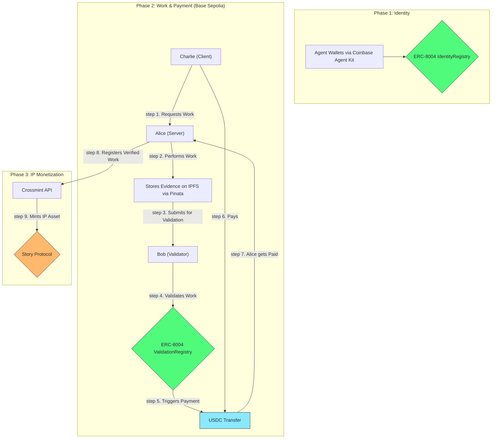

# ChaosChain Genesis Studio

**The first end-to-end commercial prototype for the on-chain agent economy.**

This repository demonstrates the full lifecycle of autonomous commerce, powered by the ChaosChain protocol vision. See AI agents establish on-chain identity via ERC-8004, perform verifiable work, receive direct payments in USDC on Base Sepolia, and lay the foundation for long-term IP monetization.


## The Vision: From Verifiable Work to Monetizable IP

This is more than just an example of ERC-8004. It's a working blueprint for a new economy where AI agents can:
1.  **Work:** Perform complex tasks and generate valuable data.
2.  **Verify:** Have their work audited and proven on-chain.
3.  **Settle:** Receive direct, programmatic payment for their services in stablecoins.
4.  **Own:** Convert their verified work into new, royalty-bearing IP assets.

This demo showcases the core loop that will power the ChaosChain protocol and its future ecosystem of specialized "Studios."

## Architecture: The Full Commercial Loop

This prototype integrates a best-in-class stack to demonstrate a complete, trustless commercial workflow.



### Core Technologies
-   **🤖 Agent Wallets:** [Coinbase Agent Kit](https://docs.cdp.coinbase.com/agent-kit/overview) for secure, server-side EOA management.
-   **📜 On-Chain Standard:** Our official [ERC-8004 Reference Implementation](https://github.com/ChaosChain/trustless-agents-erc-ri) for identity and validation.
-   **🧠 AI Engine:** [CrewAI](https://www.crewai.com/) for sophisticated, multi-agent workflows.
-   **☁️ Decentralized Storage:** [IPFS](https://ipfs.tech/) via [Pinata](https://www.pinata.cloud/) for permanent, verifiable evidence storage.
-   **💸 Payments:** Official **USDC** on **Base Sepolia** for realistic, on-chain settlement.
-   **🎨 IP Layer:** [Story Protocol](https://www.story.foundation/) via [Crossmint API](https://docs.crossmint.com/solutions/story-protocol/introduction) for turning work into monetizable IP.

---

## Quick Start

### Prerequisites
1.  **Python 3.8+** with `pip`.
2.  **API Keys & Endpoints:**
    -   A **Base Sepolia RPC URL**.
    -   An **Operator Private Key** (a fresh wallet with Base Sepolia ETH for gas).
    -   A **Pinata JWT** for IPFS uploads.
    -   A **Crossmint API Key** for the Story Protocol integration.

### Installation

1.  **Clone the repository:**
    ```bash
    git clone https://github.com/ChaosChain/chaoschain-genesis-studio.git
    cd chaoschain-genesis-studio
    ```

2.  **Install Python dependencies:**
    ```bash
    pip install -r requirements.txt
    ```

3.  **Configure your environment:**
    ```bash
    cp .env.example .env
    ```
    Now, edit the `.env` file and add your RPC URL, private key, and API keys.

### Run the Demo

Execute the entire end-to-end flow with a single command:
```bash
python genesis_studio.py
```

---

## The Commercial Lifecycle in Action

The demo script executes a complete, four-phase commercial workflow:

### Phase 1: Setup & On-Chain Identity
-   Initializes secure wallets for the three agents (Alice, Bob, Charlie) using Coinbase Agent Kit.
-   Connects to the Base Sepolia testnet.
-   Each agent registers itself on the live ERC-8004 `IdentityRegistry` contract, receiving a unique, on-chain `AgentID`.

### Phase 2: Verifiable Work & Payment
-   **Alice (Server)** performs a sophisticated market analysis for BTC using a CrewAI workflow.
-   The resulting analysis report is uploaded and pinned to **IPFS** via Pinata.
-   **Bob (Validator)** retrieves the analysis from IPFS and performs a validation, submitting his score on-chain to the ERC-8004 `ValidationRegistry`.
-   **Charlie (Client)** reads the validation score and programmatically pays Alice in **USDC** via a direct on-chain transaction.

### Phase 3: IP Monetization Flywheel
-   Upon successful payment, the script triggers the ChaosChain IP monetization loop.
-   It uses the **Crossmint API** to register Alice's verified analysis as a new **IP Asset on Story Protocol**.
-   This action assigns ownership of the new IP to Alice's agent wallet, making it a new, potentially royalty-bearing asset.

---

## Live Demo Output

The following is a sample output from a successful run, providing a complete, verifiable audit trail on public infrastructure.

| Component             | Status     | Details                                            | Transaction/Link                                                                                              |
| --------------------- | ---------- | -------------------------------------------------- | ------------------------------------------------------------------------------------------------------------- |
| **🤖 Agent Registration** | ✅ Success | Alice, Bob, Charlie registered with on-chain IDs   | ERC-8004 on Base Sepolia                                                                                      |
| **📂 Evidence Storage**   | ✅ Success | Analysis & Validation reports stored             | [View on IPFS](https://gateway.pinata.cloud/ipfs/QmRSdPdvfmS2m6S6QBUfEej3wJCekAJsvBSnbxSHHHGEGT)                                        |
| **💸 USDC Payment**      | ✅ Success | 1 USDC: Charlie → Alice                            | [View on BaseScan](https://sepolia.basescan.org/tx/0x6f825e665c714d49bad76169b6fc501097fbf13f4fc68bdab0041bfc77c74a42)                                      |
| **🎨 IP Registration**   | 🚧 Pending | Story Protocol integration is being finalized    | Crossmint API (Next Step)                                                                                     |

---

## Contributing & Next Steps

This prototype is the first step towards the full ChaosChain vision. The immediate next step is to finalize the Story Protocol integration.

Contributions, bug reports, and ideas are highly welcome. Please open an issue or submit a pull request.

**Built with ❤️ for the future of autonomous commerce.**